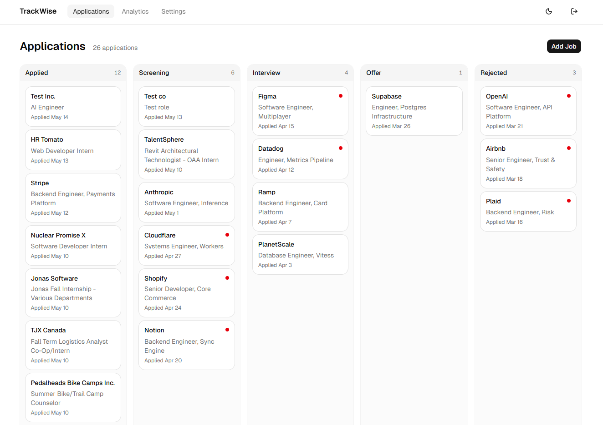
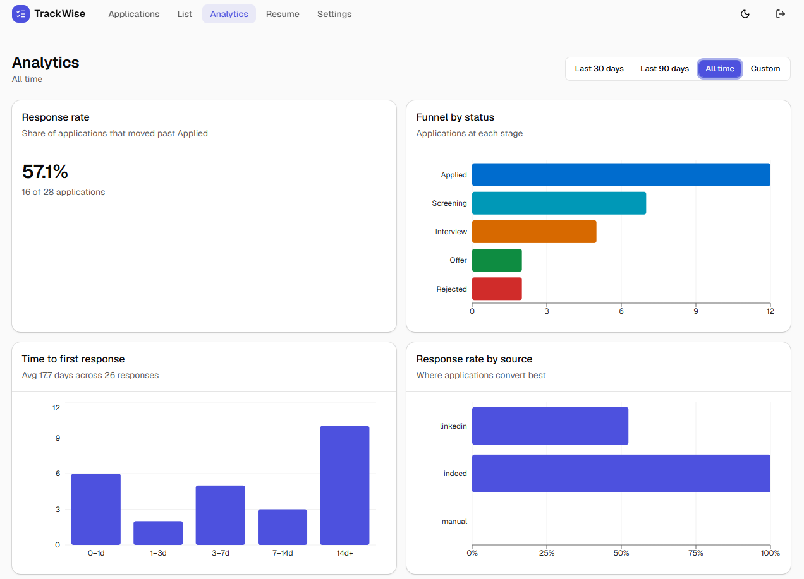
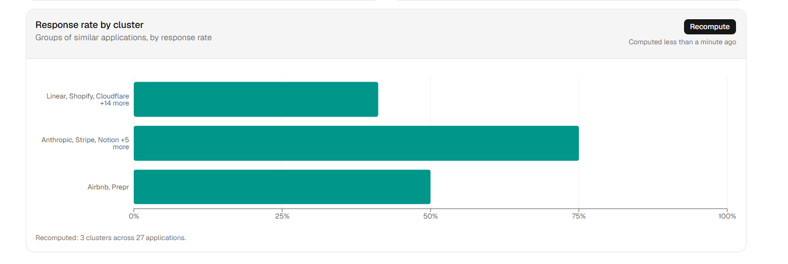
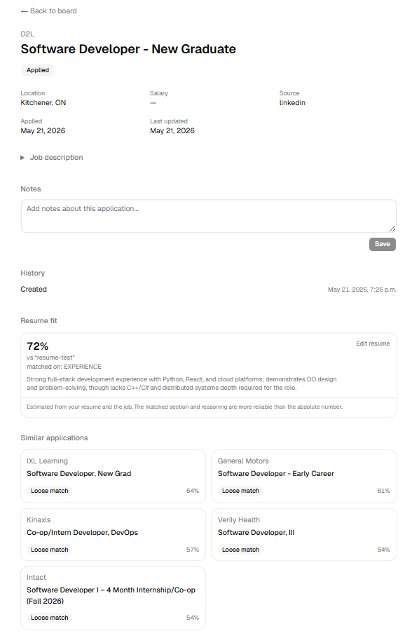
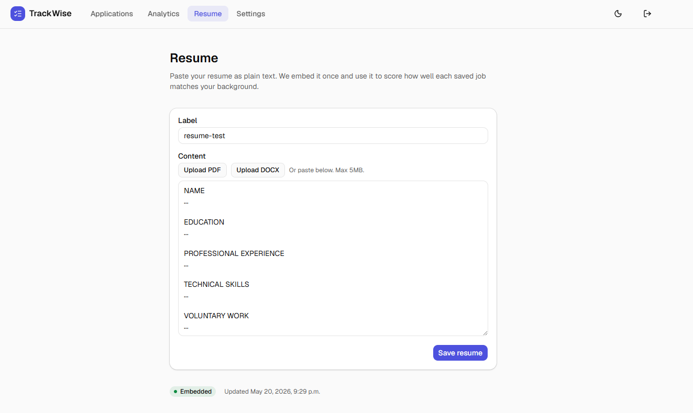
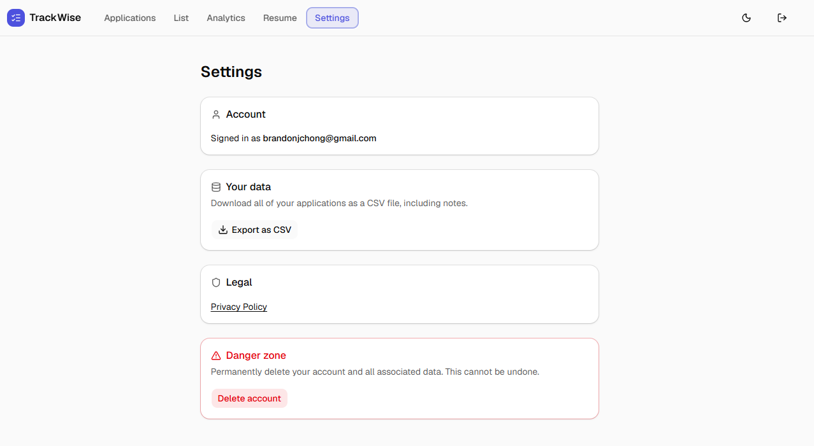
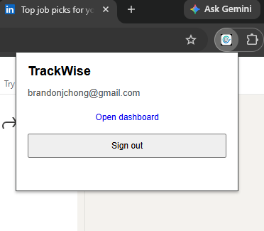
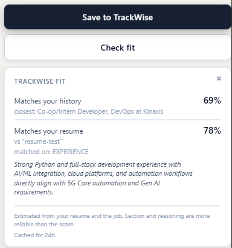

# TrackWise

A job application tracker built around analytics, not logging.

Most trackers treat the application list as the primary artifact and bolt analytics on as an afterthought. TrackWise inverts that: response rate, time-to-response, source effectiveness, and semantic clustering are the primary view; the list is supporting infrastructure.



> **Status:** v1 in launch prep. Dashboard live on Vercel; Chrome extension build ready for Web Store submission. See [Privacy Policy](https://trackwise-lac-nu.vercel.app/privacy).

## Why this exists

Existing trackers (Huntr, Teal, Simplify) treat the application list as the artifact and analytics as a side panel. TrackWise inverts that. The list exists so the analytics has something to teach you.

- **Analytics is first-class, not bolted on.** Response rate, funnel, time-to-response, source effectiveness — front and center.
- **Embeddings surface patterns you wouldn't notice manually.** K-means on Voyage AI vectors groups your applications into clusters labelled by their top companies, so you can see "I respond well to dev-tooling roles, badly to fintech" without ever tagging anything.
- **Resume-fit feedback that explains itself.** Every saved job is scored against your resume by Claude Haiku, with a one-sentence reason citing which section matched (or what's missing). Shown both on the dashboard and live in a "Check fit" overlay on LinkedIn/Indeed before you apply.
- **Free-tier first.** Whole stack runs on free tiers (Supabase, Vercel, Voyage AI, GitHub). Claude Haiku usage is ~$0.001 per cached fit score. One-time $5 for the Chrome Web Store registration. ~$0/month recurring.

## Features

### Capture
- **Chrome extension** (Manifest V3) — detects job postings on LinkedIn (`/jobs/*`) and Indeed (`/viewjob*`, `/jobs*`) and saves them with one click.
- **Job description capture** — the parser pulls the full JD body at save time, stored alongside the application so the embedding and fit-score paths have real posting content to judge against.
- **"Check fit" overlay** — alongside Save, a Check-fit button shows how the current page matches your history and your resume without leaving the site. Scores are cached for 24h per URL.

### Track
- **Kanban board** — five-column drag-and-drop (Applied → Screening → Interview → Offer → Rejected) with stale-application indicators.
- **Editable notes and JD** — inline editing on the application detail page, saved via server actions. Editing the role, company, notes, or JD re-fires the embedding chain.
- **CSV export** — one-click export of all your applications from the dashboard.

### Learn
- **Analytics page** — response rate, funnel by status, time-to-response histogram, response rate by source. Date-range filter.
- **Cluster analytics** — K-means over embeddings groups your applications into clusters labelled by the top companies in each, with per-cluster response rates. Recompute on demand.
- **Semantic similarity** — each application is embedded by Voyage AI (`voyage-3`, 1024 dims) and matched against your others via pgvector cosine search. Burst rate-limit failures are retried automatically with exponential backoff.
- **Resume fit** — paste or upload a resume (PDF/DOCX text-extracted in-browser). Section-level chunks are embedded; the top candidates per job go through Claude Haiku for a 0-100 score with a one-sentence reason. Fallback chain Haiku → Voyage rerank-2.5 → raw cosine ensures the card always renders. Results cache per (application, resume) pair.

### Account
- Google OAuth sign-in; one-click account deletion that cascades to every saved application and event.

## Screenshots

### Analytics


### Cluster analytics


### Application detail
Resume fit score with one-sentence reasoning, collapsible job description, status history, and Similar applications by cosine band.



### Resume
Paste plain text, or upload a PDF/DOCX (text is extracted in-browser; the original file is never uploaded). Section-level chunks embed automatically.



### Settings
Account info, CSV export, privacy policy link, and the account-deletion danger zone.



### Chrome extension
| Popup (signed in) | Check fit overlay on a job page |
|---|---|
|  |  |

## Architecture

```
+---------------------+         +----------------------+
|  Chrome Extension   |         |  Next.js Dashboard   |
|  - content scripts  |         |  - Kanban board      |
|  - background SW    |         |  - Analytics page    |
|  - popup UI         |         |  - Detail views      |
|  - Check-fit overlay|         |  - Resume fit card   |
+----------+----------+         +-----------+----------+
           |                                |
           |        +----------------+      |
           +------->|    Supabase    |<-----+
                    |  Postgres+Auth |
                    |   + pgvector   |
                    | + Edge Funcs   |
                    +-------+--------+
                            |
              +-------------+-------------+
              v                           v
      +----------------+         +-------------------+
      |   Voyage AI    |         |     Anthropic     |
      |  (embeddings + |         |  (Claude Haiku    |
      |    rerank)     |         |   fit scoring)    |
      +----------------+         +-------------------+
```

The full design — data model, RLS policies, triggers, build phases, decision log — lives in [`TrackWise.md`](./TrackWise.md). The agent-facing rules for working in this repo live in [`CLAUDE.md`](./CLAUDE.md) and the per-folder equivalents.

## Tech stack

| Layer | Tech |
|---|---|
| Extension | TypeScript + Vite + @crxjs/vite-plugin (Manifest V3, vanilla TS, no React) |
| Dashboard | Next.js 16 (App Router), TypeScript, Tailwind, shadcn/ui, Recharts, @dnd-kit/core |
| Backend | Supabase Postgres (region `ca-central-1`) + Auth + RLS + Edge Functions (Deno) |
| Vector search | pgvector with cosine distance |
| Embeddings | Voyage AI `voyage-3` (1024 dims), `rerank-2.5` for cross-encoder rerank fallback |
| Resume-fit scoring | Anthropic Claude Haiku 4.5 (tool-use for structured JSON output) |
| Resume parsing | `pdfjs-dist` (PDF) + `mammoth` (DOCX), both browser-side; only extracted text leaves the browser |
| Hosting | Vercel Hobby (dashboard), Chrome Web Store (extension) |

## Repository layout

```
trackwise/
  apps/
    dashboard/   Next.js 16 App Router
    extension/   Manifest V3 Chrome extension
  packages/
    types/       Generated Supabase types + shared hand-written types
  supabase/
    migrations/  Numbered, append-only SQL migrations
    functions/   Deno Edge Functions (generate-embedding, cluster-embeddings)
  scripts/       One-shot utilities (e.g. backfill-embeddings.mjs)
  docs/          Verification reports, ops notes, screenshots
```

## Local development

Requires Node 24 (`.nvmrc`), pnpm 10, and Docker (for `supabase start`).

```bash
# 1. Install
pnpm install

# 2. Configure env
cp .env.example apps/dashboard/.env.local
cp .env.example apps/extension/.env.local
# Fill in the Supabase URL/keys for each app.

# 3. Run the dashboard
pnpm --filter dashboard dev
# → http://localhost:3000

# 4. Build the extension and load it unpacked
pnpm --filter extension build
# Then in chrome://extensions, enable Developer mode → Load unpacked → apps/extension/dist
```

For backend work (migrations, Edge Functions), see [`supabase/CLAUDE.md`](./supabase/CLAUDE.md). Edge Function secrets (`VOYAGE_API_KEY`, `ANTHROPIC_API_KEY`, `EDGE_FUNCTION_SECRET`) are set via `supabase secrets set` — never in any `.env` file.

## Security

- Row-level security on every user-data table. Cross-account isolation verified against the production project; see [`docs/rls-verification.md`](./docs/rls-verification.md) for the full audit trail.
- Service-role key is server-only (`import 'server-only'` on the admin client). The browser bundle never sees it.
- Voyage AI and Anthropic keys live as Supabase Edge Function secrets, never in client code or the browser bundle. The dashboard reaches the Anthropic API only through the `score-resume-fit` Edge Function.
- Resume files (PDF/DOCX) are parsed in the browser; only the extracted text reaches the server. The original file is never uploaded.
- Extension requests only `storage`, `activeTab`, `identity`, and host permissions scoped to LinkedIn and Indeed job pages — no `<all_urls>`, no `tabs`.

## Known followups

- **Next.js 16 middleware deprecation.** The `apps/dashboard/middleware.ts` convention is being renamed to `proxy.ts` ([upgrade notes](https://nextjs.org/docs/messages/middleware-to-proxy)). Emits a build warning today; still works. To migrate before a future Next major removes it.

## License

[MIT](./LICENSE) © Brandon Chong
