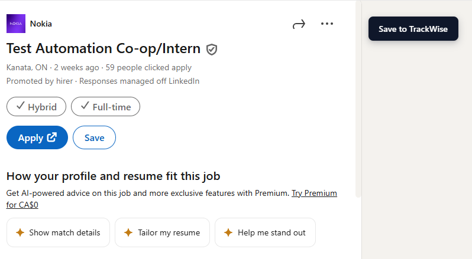

# TrackWise

A job application tracker built around analytics, not logging.

Most trackers treat the application list as the primary artifact and bolt analytics on as an afterthought. TrackWise inverts that: response rate, time-to-response, source effectiveness, and semantic clustering are the primary view; the list is supporting infrastructure.


> **Status:** v1 in launch prep. Chrome extension submitted to the Web Store; dashboard deployed to Vercel. See [Privacy Policy](https://trackwise-lac-nu.vercel.app/privacy).

## Why this exists

Existing trackers (Huntr, Teal, Simplify) treat the application list as the artifact and analytics as a side panel. TrackWise inverts that. The list exists so the analytics has something to teach you.

- **Analytics is first-class, not bolted on.** Response rate, funnel, time-to-response, source effectiveness — front and center.
- **Embeddings surface patterns you wouldn't notice manually.** K-means on Voyage AI vectors groups your applications into clusters labelled by their top companies, so you can see "I respond well to dev-tooling roles, badly to fintech" without ever tagging anything.
- **Free-tier first.** Whole stack runs on free tiers (Supabase, Vercel, Voyage AI, GitHub). One-time $5 for the Chrome Web Store registration. $0/month recurring.

## Features

### Capture
- **Chrome extension** (Manifest V3) — detects job postings on LinkedIn (`/jobs/*`) and Indeed (`/viewjob*`, `/jobs*`) and saves them with one click.

### Track
- **Kanban board** — five-column drag-and-drop (Applied → Screening → Interview → Offer → Rejected) with stale-application indicators.
- **Editable notes** — inline note editing on the application detail page, saved via server actions.
- **CSV export** — one-click export of all your applications from the dashboard.

### Learn
- **Analytics page** — response rate, funnel by status, time-to-response histogram, response rate by source. Date-range filter.
- **Cluster analytics** — K-means over embeddings groups your applications into clusters labelled by the top companies in each, with per-cluster response rates. Recompute on demand.
- **Semantic similarity** — each application is embedded by Voyage AI (`voyage-3-lite`, 512 dims) and matched against your others via pgvector cosine search. Burst rate-limit failures are retried automatically with exponential backoff.

### Account
- Google OAuth sign-in; one-click account deletion that cascades to every saved application and event.

## Screenshots

### Analytics


### Cluster analytics


### Application detail with semantic similarity


### Chrome extension
| Popup (signed in) | Save button injected on LinkedIn |
|---|---|
|  |  |

## Architecture

```
+---------------------+         +----------------------+
|  Chrome Extension   |         |  Next.js Dashboard   |
|  - content scripts  |         |  - Kanban board      |
|  - background SW    |         |  - Analytics page    |
|  - popup UI         |         |  - Detail views      |
+----------+----------+         +-----------+----------+
           |                                |
           |        +----------------+      |
           +------->|    Supabase    |<-----+
                    |  Postgres+Auth |
                    |   + pgvector   |
                    | + Edge Funcs   |
                    +-------+--------+
                            |
                            v
                    +----------------+
                    |  Voyage AI API |
                    |  (embeddings)  |
                    +----------------+
```

The full design — data model, RLS policies, triggers, build phases, decision log — lives in [`TrackWise.md`](./TrackWise.md). The agent-facing rules for working in this repo live in [`CLAUDE.md`](./CLAUDE.md) and the per-folder equivalents.

## Tech stack

| Layer | Tech |
|---|---|
| Extension | TypeScript + Vite + @crxjs/vite-plugin (Manifest V3, vanilla TS, no React) |
| Dashboard | Next.js 16 (App Router), TypeScript, Tailwind, shadcn/ui, Recharts, @dnd-kit/core |
| Backend | Supabase Postgres (region `ca-central-1`) + Auth + RLS + Edge Functions (Deno) |
| Vector search | pgvector with cosine distance |
| Embeddings | Voyage AI `voyage-3-lite` (512 dims) |
| Hosting | Vercel Hobby (dashboard), Chrome Web Store (extension) |

## Repository layout

```
trackwise/
  apps/
    dashboard/   Next.js 16 App Router
    extension/   Manifest V3 Chrome extension
  packages/
    types/       Generated Supabase types + shared hand-written types
  supabase/
    migrations/  Numbered, append-only SQL migrations
    functions/   Deno Edge Functions (generate-embedding, cluster-embeddings)
  scripts/       One-shot utilities (e.g. backfill-embeddings.mjs)
  docs/          Verification reports, ops notes, screenshots
```

## Local development

Requires Node 24 (`.nvmrc`), pnpm 10, and Docker (for `supabase start`).

```bash
# 1. Install
pnpm install

# 2. Configure env
cp .env.example apps/dashboard/.env.local
cp .env.example apps/extension/.env.local
# Fill in the Supabase URL/keys for each app.

# 3. Run the dashboard
pnpm --filter dashboard dev
# → http://localhost:3000

# 4. Build the extension and load it unpacked
pnpm --filter extension build
# Then in chrome://extensions, enable Developer mode → Load unpacked → apps/extension/dist
```

For backend work (migrations, Edge Functions), see [`supabase/CLAUDE.md`](./supabase/CLAUDE.md).

## Security

- Row-level security on every user-data table. Cross-account isolation verified against the production project; see [`docs/rls-verification.md`](./docs/rls-verification.md) for the full audit trail.
- Service-role key is server-only (`import 'server-only'` on the admin client). The browser bundle never sees it.
- Voyage AI key lives as a Supabase Edge Function secret, never in client code.
- Extension requests only `storage`, `activeTab`, `identity`, and host permissions scoped to LinkedIn and Indeed job pages — no `<all_urls>`, no `tabs`.

## License

[MIT](./LICENSE) © Brandon Chong
